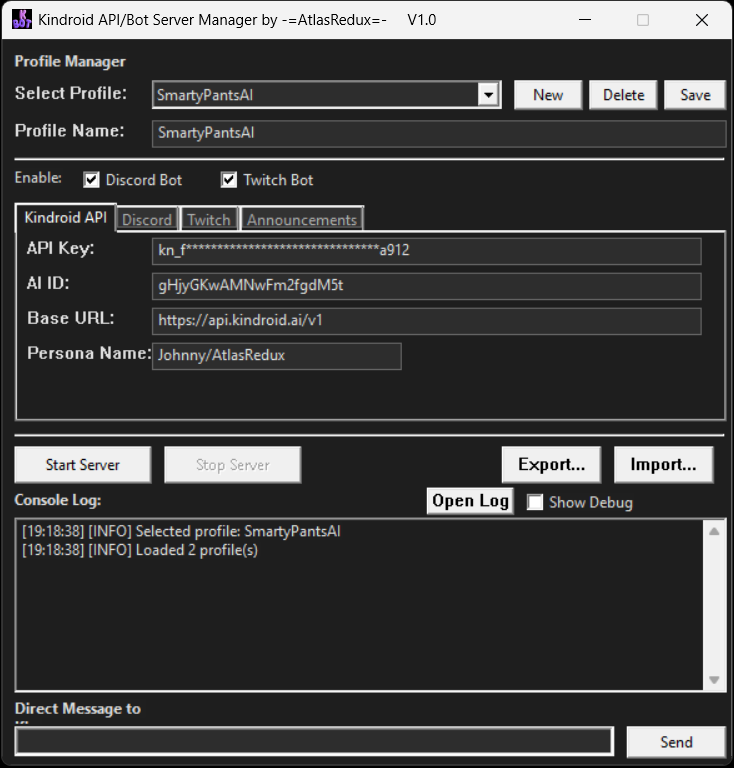
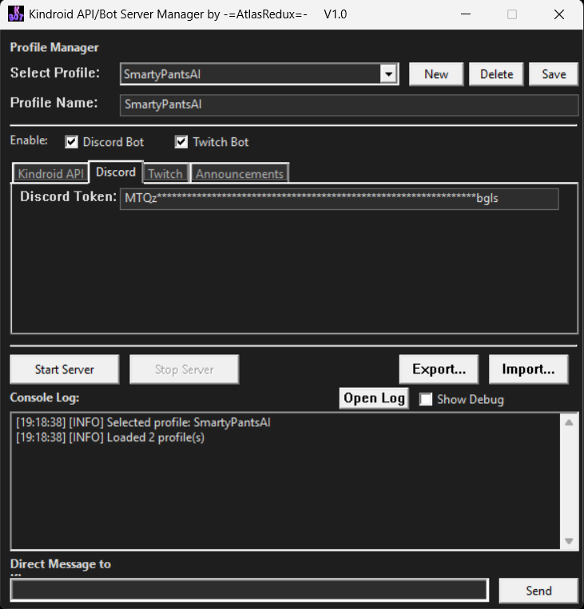
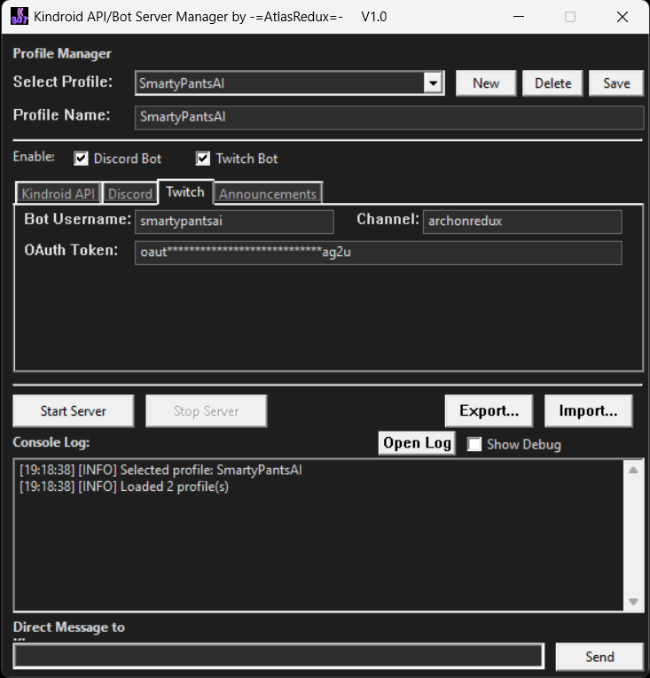
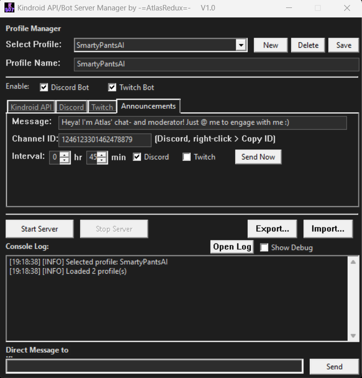

<p align="center">
  
</p>

# Kindroid Bot Manager
[](https://github.com/AtlasRedux/Kindroid-API-Bot-Server-Manager/releases/latest)

A native Windows application that bridges your [Kindroid AI](https://kindroid.ai) character to Discord and Twitch chat platforms. Built entirely with native Windows APIs - no external dependencies required.


## Features

- **Multi-Platform Support** - Connect your Kindroid AI to both Discord and Twitch simultaneously
- **Profile Management** - Save and switch between multiple bot configurations
- **Scheduled Announcements** - Automatically send timed messages to your channels
- **Dark Mode UI** - Modern tabbed interface with full dark theme
- **Direct Messaging** - Test your Kindroid directly from the app
- **Zero Dependencies** - Pure native Windows code using Schannel SSL, WinHTTP, and Win32 APIs
- **Portable** - Single executable, no installation required

## Screenshots

<p align="center">
  
  
</p>
<p align="center">
  
  
</p>

## Getting Started

### Prerequisites

- Windows 10/11 (64-bit)
- Visual Studio 2022 (for building from source)
- A [Kindroid](https://kindroid.ai) account with API access
- Discord Bot Token (for Discord integration)
- Twitch OAuth Token (for Twitch integration)

### Installation

1. Download the latest release from the [Releases](../../releases) page
2. Extract `KindroidBotManager.exe` to your preferred location
3. Run the application

### Building from Source

1. Clone this repository
2. Open `KindroidDiscordBot.vcxproj` in Visual Studio 2022
3. Build in Release x64 configuration

Or use the included build script:
```batch
build.bat
```

## Configuration

### Kindroid API Setup

1. Log into your [Kindroid](https://kindroid.ai) account
2. Navigate to API settings to obtain your **API Key** and **AI ID**
3. Enter these in the "Kindroid API" tab

### Discord Bot Setup

1. Go to the [Discord Developer Portal](https://discord.com/developers/applications)
2. Create a new application and add a bot
3. Enable these Privileged Gateway Intents:
   - Message Content Intent
   - Server Members Intent (optional)
4. Copy the bot token and paste it in the "Discord" tab
5. Invite the bot to your server using OAuth2 URL Generator with `bot` scope and appropriate permissions

### Twitch Bot Setup

1. Create or use an existing Twitch account for your bot
2. Generate an OAuth token at [twitchapps.com/tmi](https://twitchapps.com/tmi/) or similar
3. Enter your bot username, OAuth token, and target channel in the "Twitch" tab

## Usage

### Managing Profiles

- **New** - Create a fresh profile configuration
- **Save** - Save current settings to the selected profile
- **Delete** - Remove the selected profile

### Starting the Bot

1. Select or create a profile
2. Enable desired platforms (Discord and/or Twitch)
3. Click "Start Server"

### Announcements

Set up periodic announcements in the "Announcements" tab:
- Enter your message
- Set the interval (hours and minutes)
- Optionally specify a Discord channel ID
- Select target platforms
- Use "Send Now" for immediate testing

### Direct Messaging

Use the "Direct Message to Kin" field at the bottom to test your Kindroid's responses without going through Discord or Twitch.

## File Structure

```
KindroidBotManager/
├── KindroidBot.h        # Main header with all declarations
├── Main.cpp             # GUI and application entry point
├── DiscordBot.cpp       # Discord WebSocket client
├── TwitchBot.cpp        # Twitch IRC client
├── KindroidAPI.cpp      # Kindroid API integration
├── ConfigManager.cpp    # Profile and config management
├── SchannelSSL.cpp      # Native Windows SSL/TLS
├── Utils.cpp            # Utilities and JSON parser
├── resource.rc          # Windows resources
├── app.ico              # Application icon
└── build.bat            # Build script
```

## Configuration Files

The application creates these files in its directory:

- `profiles.json` - Saved bot profiles (encrypted tokens)
- `log.txt` - Console output history (includes debug messages)

## Troubleshooting

### Discord bot not responding
- Verify Message Content Intent is enabled in Discord Developer Portal
- Check that the bot has permissions to read/send messages in the channel
- Review `log.txt` for connection errors

### Twitch bot not connecting
- Ensure OAuth token starts with `oauth:`
- Verify the channel name doesn't include `#`
- Check that the bot account isn't banned from the channel

### Kindroid not responding
- Verify API Key and AI ID are correct
- Check your Kindroid account has API access
- Review the console for API error messages

## Contributing

Contributions are welcome! Please feel free to submit issues and pull requests.

## License

This project is licensed under the MIT License - see the [LICENSE](LICENSE) file for details.

## Acknowledgments

- [Kindroid](https://kindroid.ai) for the amazing AI platform
- Built with native Windows APIs (no external dependencies!)

## Author

**AtlasRedux**

---

*This project is not affiliated with Kindroid, Discord, or Twitch.*
